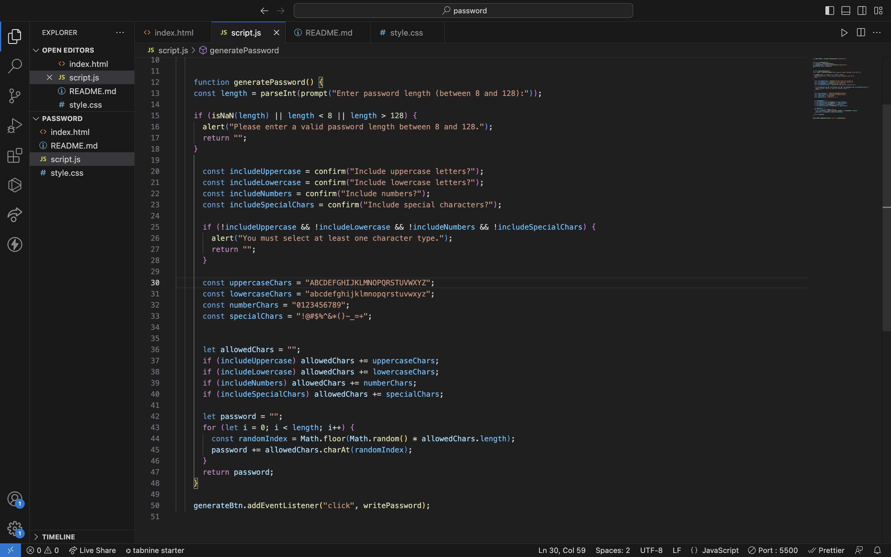
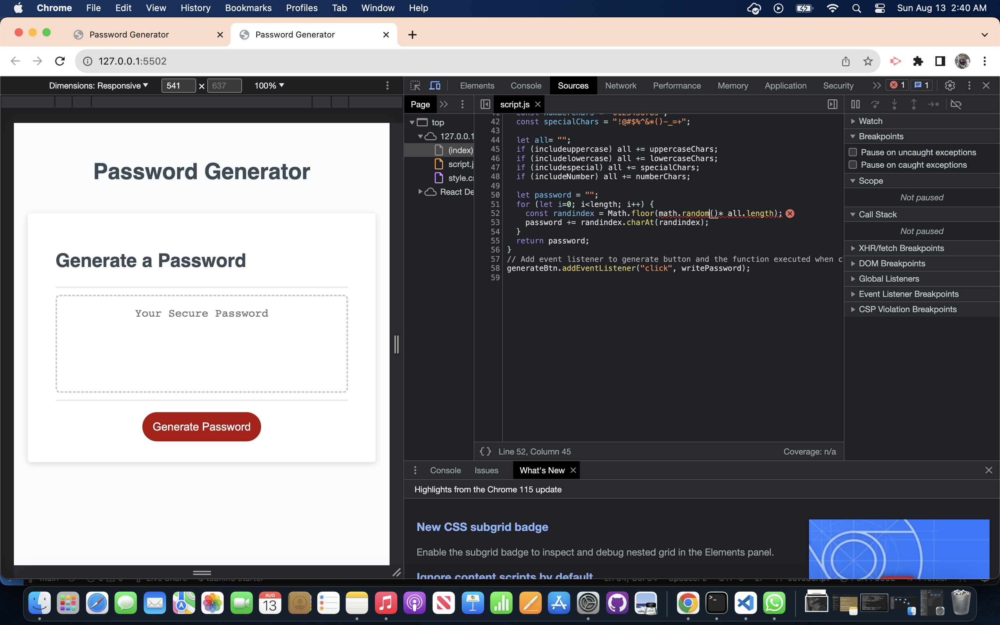
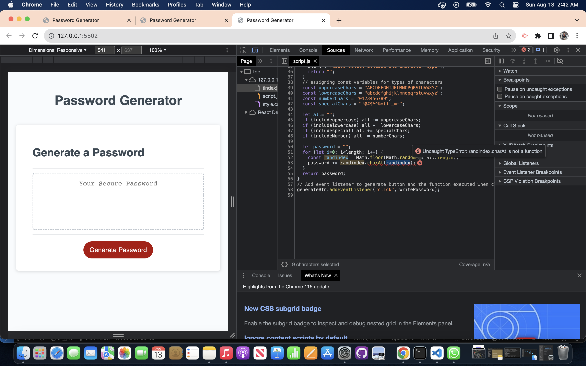
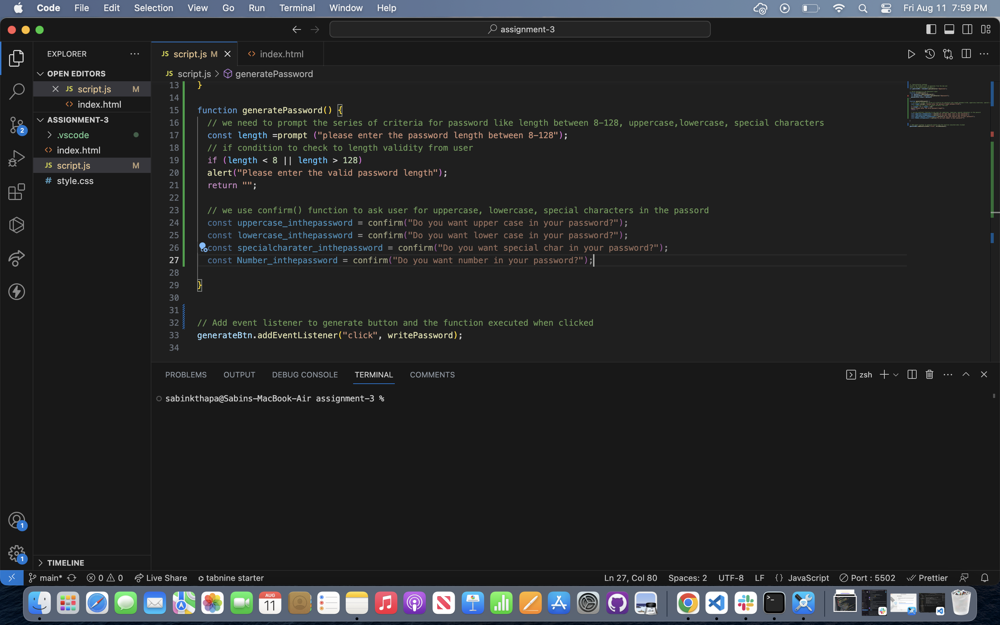
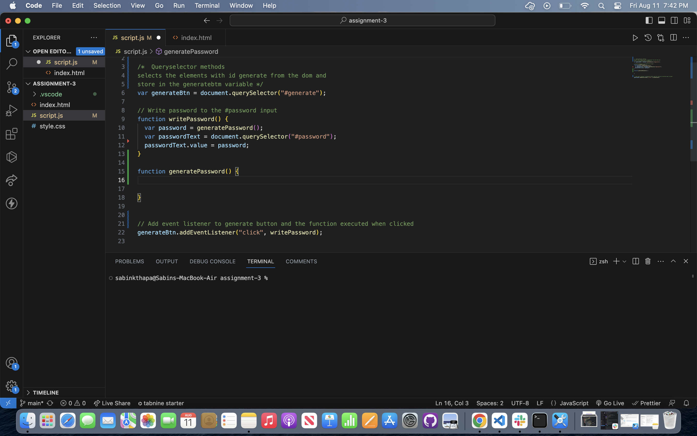
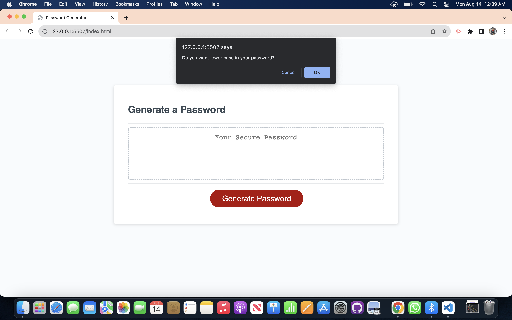
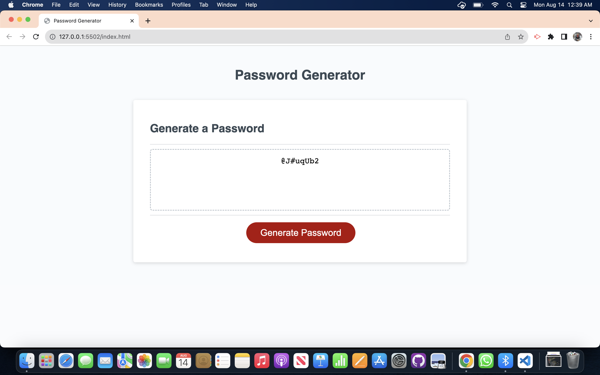

# Random Password Generator

## This password generator can be used by anyone who want to generate random passwords with the criteria specified. This app run in the browser with dynamically updated HTML and css with javascript. Those who want to learn javascript and its various aspects like functions, build-in methods, loop is recommended to look at each code line and the comment i put in each line tocle assist user for better understanding. The basic foudational of javascript can be learn from this app so could be stepping stones further to develop skills more on it for further development.

- motivational : Learning foundation of JavaScript is a great way to move on to gradually dive deep more on intermediate and advanced JavaScript. Starting from simple app will help on lot of practise on basic aspects of javascript and will definetely help user to have a skill that can be use while learning REACT so my motivation for this app is to user to adapt with basic things first before jumpting to react.

- Reason for this project : This project will help the user to better understanding of function, inbuild-method, condition, selecting element , DOM event listeners(click in this case), document method (querySelector).

- Problem this project solved : This project will help how css ,html elements with individual ID link to select and add event listener can be use to have functionality in javascript. Basic is everthing to move forward , user can get basic of function , logic building ,method and built a snapshot in the mind how we can interlink and complete the simple useful app.

## Usage
Securing everything from computer log in to other login credentials in email , banking information is vital so password with different characters type is essential to have a strong password and stay away possible hacks. This app can be useful to generate a password based on user choices of characters type and save for usuage.

Some snapshots during building of this application:

## Deployment Link
- please check the deployed link below:

-https://sabinkthapa.github.io/password-generator/
